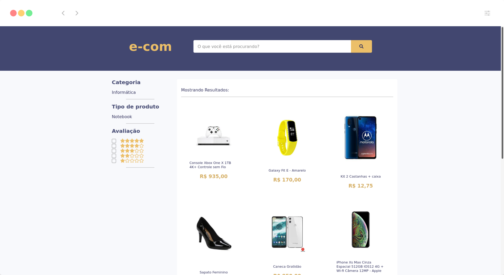
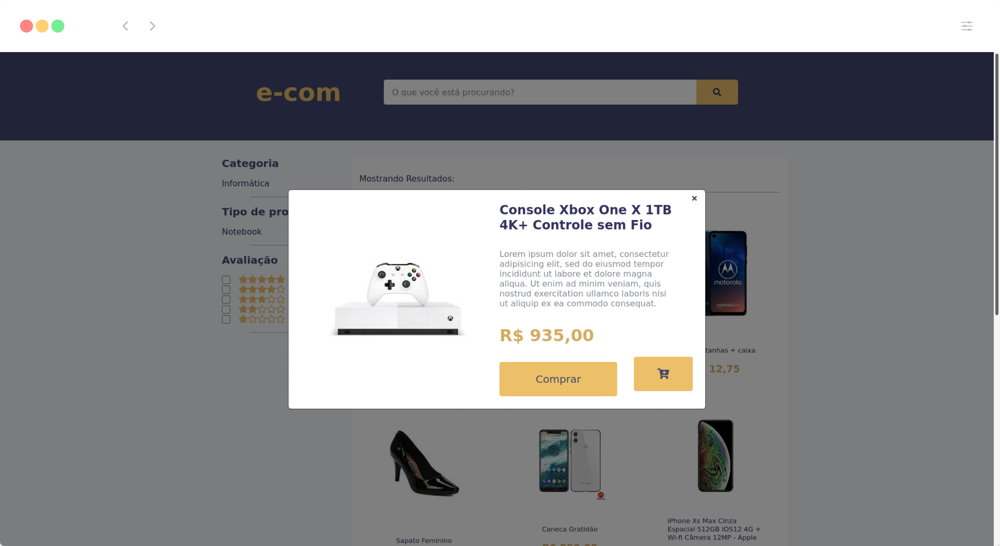
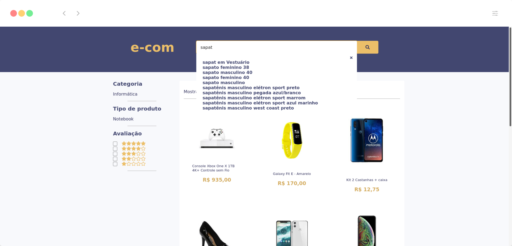

<h1 align="center">Teste prático para Frontend Developer</h1> 

##  :camera: Screenshots
<p align="center"></p>
<p align="center">

##  :warning: CORS
##### Existe um problema de CORS na API, por padrão um servidor web só aceita requisições do mesmo servidor, como aplicação não tem backend, colocar `header: "Access-Control-Allow-Origin", "*";` não surte nenhum efeito.
##### Para contornar esse problema foi adicionado o [cors-anywhere](https://cors-anywhere.herokuapp.com/). Antes de executar a aplicação local é necessario acessar o site [https://cors-anywhere.herokuapp.com/](https://cors-anywhere.herokuapp.com/) e clicar no botão `"Request temporary access to the demo server"`

##  :computer: Deploy
- [e-com](https://)

##  :sparkles: Tecnologias usadas
- [React](https://reactjs.org/)
- [TypeScript](https://www.typescriptlang.org/)
- [Styled-Components](https://styled-components.com/)
- [Axios](https://github.com/axios/axios)

##  :arrow_forward: Como executar

### Clonar projeto
```bash 
$ git clone https://github.com/sihann/e-com.git
$ cd e-com
```
### Instalar as dependências
```bash 
#yarn
$ yarn install

#npm
$ npm install
```
### Executar

```bash 
#yarn
$ yarn start

#npm
$ npm start
```

##### Aplicação abrirá no [http://localhost:3000](http://localhost:3000)
##### Lembre-se de acessar o cors-anywhere e abilitar o demo server.

##  :memo: Considerações

### Projeto
- Por falta de uma documentação de como usar a API, tive uma certa dificuldade em construir as funcionalidades, já que a API é um tanto confusa.
- Houve problemas com o Cors.
- A busca por autocomplete não funciona corretamente, a requisição é feita, mas não mostra a página do produto, pois o link na API é protegido.
- Sobre a estrutura do projeto, priorizei seguir uma padronização levando em conta a manutenção do código por outros desenvolvedores. 
### Layout
- Usei o layout do [Michael Yonke](https://dribbble.com/shots/11288051-Amazon-Search-Results/attachments/2897104?mode=media) como inspiração para e-com.
### Tecnologias
- ReactJs porque sei que a empresa vem se mordenizando e atualizando os códigos para o uso dessa tecnologia
- Fontawesome para alguns ícones
- Apesar de no briefing a empresa dizer que ficaria impressionada com o uso de "BEM naming" e feliz com o uso de Pre processadores de CSS, eu optei por usar Stled-components, pois é um forma mais segura e perfomática de fazer o escopo de estilos em ReactJS. 
- Usei o Axios por ser mais simples e fácil de compreender e implementar no projeto.
- Usei TypeScript por ser uma ferramenta que possibilita descobrir erros durante o desenvolvimento, permitindo visualizar pontos de melhoria e problemas de compilação resultando em uma aplicação mais segura.
### Testes
- Apesar de ter conhecimento sobre, ainda não sei implementar testes unitários. Mesmo assim, depois que finalizei a aplicação, procurei algo que fosse de fácil aprendizagem e implementação, mas infelizmente não achei nada para atender esse requesito. 